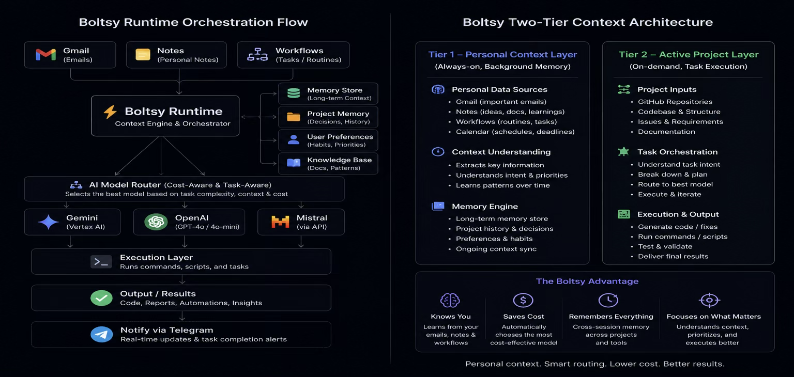

# Boltsy Runtime

Boltsy Runtime is a lightweight orchestration prototype for running coding agents as a small, coordinated delivery system. The core idea is simple: coding models should focus on code, while the orchestrator owns business context, task routing, state, model choice, and the definition of "done."

## Project Artifacts

| Artifact | Link |
| --- | --- |
| Pitch deck | [Ramaiah_Kapidhwaja.pptx](docs/Ramaiah_Kapidhwaja.pptx) |
| Written report | [Ramaiah_Kapidhwaja.pdf](docs/Ramaiah_Kapidhwaja.pdf) |
| Demo video | [Ramaiah-Kapidhwaja-demo.mp4](docs/Ramaiah-Kapidhwaja-demo.mp4) |

## Demo Video

[Watch or download the demo video](docs/Ramaiah-Kapidhwaja-demo.mp4)

> If GitHub does not stream the video inline, open the link above and use the download/raw view.

## 1. Problem

Modern coding agents are powerful, but they are usually used as isolated executors. They can read code, edit files, and run tests, but they do not naturally remember the business goal, prioritize work, coordinate multiple tasks, or decide when a pull request is truly ready.

The result is wasted context, repeated instructions, inconsistent model choice, and too much human babysitting. The bottleneck is not always the model. It is the orchestration layer around the model.

Boltsy Runtime addresses this by separating business memory from code execution. The orchestrator keeps the long-running context and turns it into focused, task-scoped prompts for coding agents.

## 2. Architecture



Boltsy uses a two-tier design:

- **Orchestrator tier:** owns business context, memory, routing policy, workflow state, model selection, and completion criteria.
- **Execution tier:** runs task-focused coding agents in isolated worktrees or sessions.
- **Validation tier:** checks lint, typecheck, tests, AI review gates, screenshots, and merge readiness.
- **Notification tier:** alerts the owner only when the workflow reaches a meaningful state.

The design goal is not to replace coding agents. It is to make them act like a coordinated team.

## 3. How Orchestration Works

The orchestration loop follows a predictable path:

1. A task arrives from a user, issue, support ticket, meeting note, or backlog item.
2. The orchestrator loads relevant business and engineering context.
3. The router classifies the task by risk, complexity, workflow type, and expected validation.
4. The model selector chooses the cheapest capable model for the task.
5. A task-scoped prompt is generated for the execution agent.
6. The execution agent works in a bounded code context.
7. Validation gates run.
8. The orchestrator updates memory and reports only actionable outcomes.

The important shift is that the agent does not need to remember everything. The orchestrator remembers and compresses.

## 4. Model Routing

Boltsy routes work by capability, not by habit.

Example routing:

| Task Type | Execution Profile | Model Class |
| --- | --- | --- |
| Small UI copy or docs | `fast` | Flash-class model |
| Routine implementation | `balanced` | Flash or light Pro model |
| Risky architecture or migration | `deep` | Pro-class model |
| Review gate | `review` | Fast model with strict criteria |
| Summarization or memory update | `cheap` | Low-cost fast model |

The goal is no token waste: use stronger models only when the task needs deeper reasoning.

See `runtime/selection.ts` and `examples/model-routing-demo.md`.

## 5. Context Aggregation

Context is gathered from three layers:

- **Business context:** product goals, customer priorities, revenue signals, roadmap, meeting notes.
- **Engineering context:** repo conventions, architecture notes, schemas, CI requirements, style guides.
- **Runtime context:** task history, validation results, failed attempts, model performance, and memory updates.

The orchestrator converts these into a small, precise prompt rather than dumping every file into the model window.

See `context/AGENTS.md`, `context/routing_policy.md`, `context/memory_policy.md`, and `context/workflow_patterns.md`.

## 6. Future Roadmap

- Add durable workflow state with resumable execution graphs.
- Add GitHub issue and pull request event ingestion.
- Add real worktree lifecycle management.
- Add CI result parsing and automatic retry routing.
- Add richer model telemetry for cost, latency, failure rate, and quality.
- Add policy-driven notification rules for merge-ready, blocked, failed, or needs-review states.
- Add a dashboard for active workflows, agent state, and delivery throughput.

## Quick Demo

The current prototype can be explored through the TypeScript runtime files:

```bash
cd runtime
tsx demo.ts
```

The demo is intentionally small. It shows the orchestration contract: classify a task, choose a model profile, aggregate context, and produce a structured execution plan.
